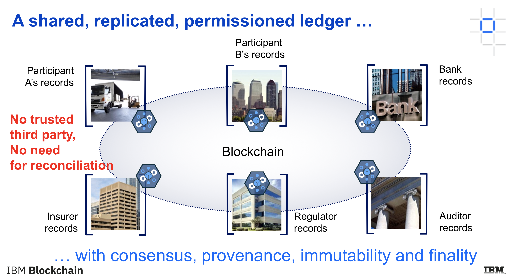
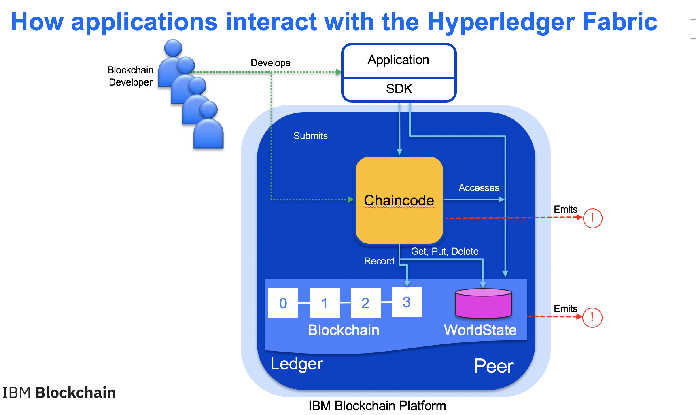
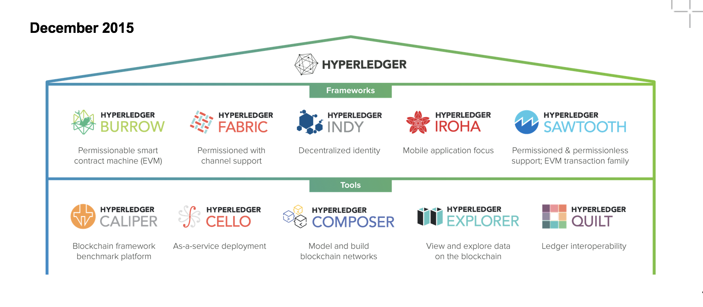
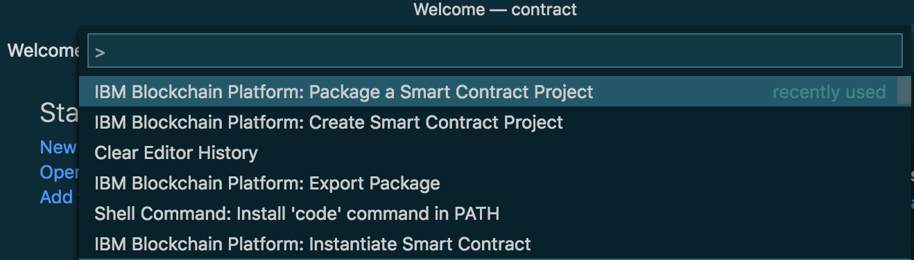
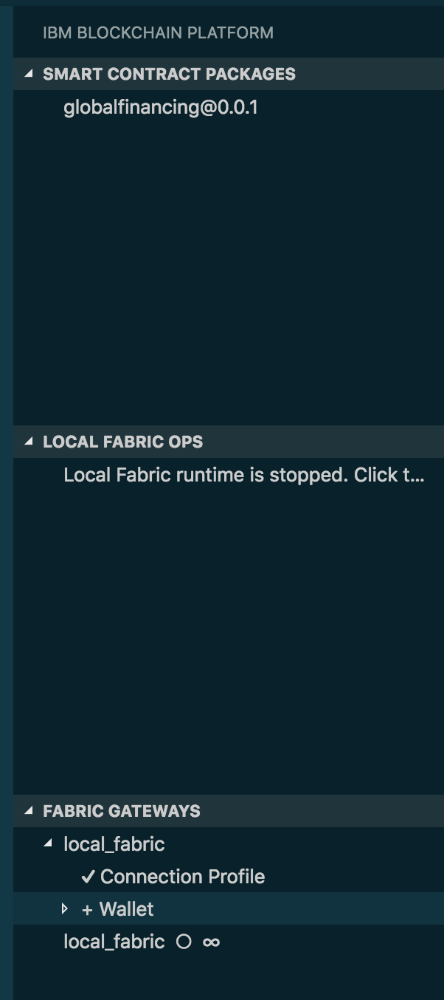
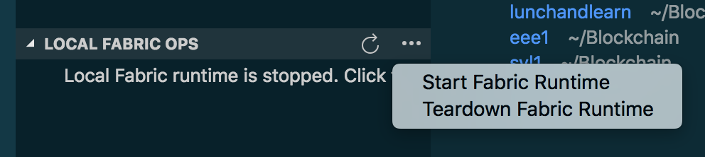
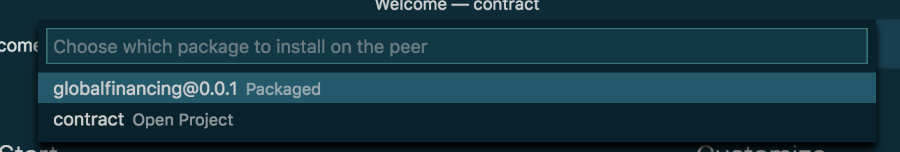
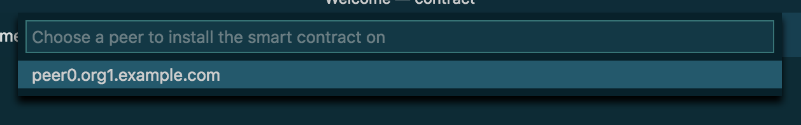
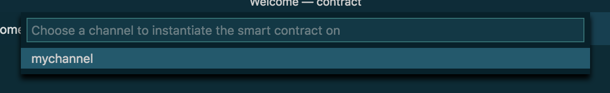
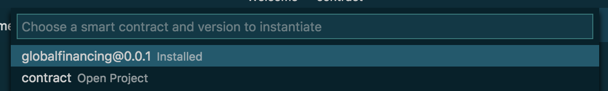

# Raheel Zubairy: Global Financing Blockchain

# URL: https://bit.ly/2HoJQxl

## Supply chain user view:
<div style='border: 2px solid #f00;'>
  
</div>

# =========================================

## Ledger view:
<div style='border: 2px solid #f00;'>
  
</div>

# =========================================

## Smart Contract:
<div style='border: 2px solid #f00;'>
  
</div>

# =========================================

## Hyperledger Fabric minimal business network

* my channel
* orderer.exmple.com
* peer().org1.example.com
* ca.example.com  // Certificate Aurthority
* Org1MSP. // Membership service provider

# =========================================

## Hyperledger Fabric:
<div style='border: 2px solid #f00;'>
  
</div>

============================================

## Smart Contract globalFinance.js 

~~~~

 /*
 * SPDX-License-Identifier: Apache-2.0
 */

'use strict';

const { Contract } = require('fabric-contract-api');

var orderStatus = {
    Created: {code: 1, text: 'Order Created'},
    Bought: {code: 2, text: 'Order Purchased'},
    Cancelled: {code: 3, text: 'Order Cancelled'},
    Ordered: {code: 4, text: 'Order Submitted to Provider'},
    ShipRequest: {code: 5, text: 'Shipping Requested'},
    Delivered: {code: 6, text: 'Order Delivered'},
    Delivering: {code: 15, text: 'Order being Delivered'},
    Backordered: {code: 7, text: 'Order Backordered'},
    Dispute: {code: 8, text: 'Order Disputed'},
    Resolve: {code: 9, text: 'Order Dispute Resolved'},
    PayRequest: {code: 10, text: 'Payment Requested'},
    Authorize: {code: 11, text: 'Payment Approved'},
    Paid: {code: 14, text: 'Payment Processed'},
    Refund: {code: 12, text: 'Order Refund Requested'},
    Refunded: {code: 13, text: 'Order Refunded'}
};

class GlobalFinance extends Contract {

    async instantiate(ctx) {
        console.info('instantiate');

        var emptyList = [];
        await ctx.stub.putState('buyers', Buffer.from(JSON.stringify(emptyList)));
        await ctx.stub.putState('sellers', Buffer.from(JSON.stringify(emptyList)));
        await ctx.stub.putState('shippers', Buffer.from(JSON.stringify(emptyList)));
        await ctx.stub.putState('providers', Buffer.from(JSON.stringify(emptyList)));
        await ctx.stub.putState('financeCos', Buffer.from(JSON.stringify(emptyList)));
        
    }

    // participant functions 

    async RegisterBuyer(ctx, buyerId, companyName) {

        var buyer = {
            "id": buyerId,
            "companyName": companyName,
            "type": "buyer",
            "orders": []            
        }        
        await ctx.stub.putState(buyerId, Buffer.from(JSON.stringify(buyer)));

        //add buyerId to 'buyers' key
        const data = await ctx.stub.getState('buyers');
        let buyers = JSON.parse(data.toString());        
        buyers.push(buyerId);
        await ctx.stub.putState('buyers', Buffer.from(JSON.stringify(buyers)));        

        return JSON.stringify(buyer);
    }


    async RegisterSeller(ctx, sellerId, companyName) {

        var seller = {
            "id": sellerId,
            "companyName": companyName,
            "type": "seller", 
            "orders": []
        }        
        await ctx.stub.putState(sellerId, Buffer.from(JSON.stringify(seller)));

        //add sellerId to 'sellers' key
        const data = await ctx.stub.getState('sellers');
        let sellers = JSON.parse(data.toString());        
        sellers.push(sellerId);
        await ctx.stub.putState('sellers', Buffer.from(JSON.stringify(sellers)));        

        return JSON.stringify(seller);
    }

    async RegisterShipper(ctx, shipperId, companyName) {

        var shipper = {
            "id": shipperId,
            "companyName": companyName,
            "type": "shipper",
            "orders": []
        }        
        await ctx.stub.putState(shipperId, Buffer.from(JSON.stringify(shipper)));
        
        //add shipperId to 'shippers' key
        const data = await ctx.stub.getState('shippers');
        let shippers = JSON.parse(data.toString());        
        shippers.push(shipperId);
        await ctx.stub.putState('shippers', Buffer.from(JSON.stringify(shippers)));   
        
        return JSON.stringify(shipper);
    }

    async RegisterProvider(ctx, providerId, companyName) {

        var provider = {
            "id": providerId,
            "companyName": companyName,
            "type": "provider",
            "orders": []
        }        
        await ctx.stub.putState(providerId, Buffer.from(JSON.stringify(provider)));

        //add providerId to 'providers' key
        const data = await ctx.stub.getState('providers');
        let providers = JSON.parse(data.toString());        
        providers.push(providerId);
        await ctx.stub.putState('providers', Buffer.from(JSON.stringify(providers)));   

        return JSON.stringify(provider);
    }


    async RegisterFinanceCo(ctx, financeCoId, companyName) {

        //store finance company data identified by financeCoId
        var financeCo = {
            "id": financeCoId,
            "companyName": companyName,
            "type": "financeCo",
            "orders": []
        }        
        await ctx.stub.putState(financeCoId, Buffer.from(JSON.stringify(financeCo)));

        //add financeCoId to 'financeCos' key
        const data = await ctx.stub.getState('financeCos');
        let financeCos = JSON.parse(data.toString());        
        financeCos.push(financeCoId);
        await ctx.stub.putState('financeCos', Buffer.from(JSON.stringify(financeCos)));   

        return JSON.stringify(financeCo);
    }


    //Order Functions

    async CreateOrder(ctx, buyerId, sellerId, financeCoId, orderNumber, items, amount) {

        //verify buyerId
        const buyerData = await ctx.stub.getState(buyerId);
        let buyer = JSON.parse(buyerData.toString());
        if (buyer.type != 'buyer') {
            throw new Error('buyer not identified');
        }

        //verify sellerId
        const sellerData = await ctx.stub.getState(sellerId);
        let seller = JSON.parse(sellerData.toString());
        if (seller.type != 'seller') {
            throw new Error('seller not identified');
        }                       

        //verify financeCoId
        const financeCoData = await ctx.stub.getState(financeCoId);
        let financeCo = JSON.parse(financeCoData.toString());
        if (financeCo.type != 'financeCo') {
            throw new Error('financeCo not identified');
        }

        var order = {
            "orderNumber": orderNumber,
            "items": items,
            "status": JSON.stringify(orderStatus.Created),
            "dispute": null,
            "resolve": null,
            "backOrder": null,
            "refund": null,
            "amount": amount,
            "buyerId": buyerId,
            "sellerId": sellerId,
            "shipperId": null,
            "providerId": null,
            "financeCoId": financeCoId
        }

        //add order to buyer
        buyer.orders.push(orderNumber);
        await ctx.stub.putState(buyerId, Buffer.from(JSON.stringify(buyer)));
        
        //add order to financeCo
        financeCo.orders.push(orderNumber);
        await ctx.stub.putState(financeCoId, Buffer.from(JSON.stringify(financeCo)));
        
        //store order identified by orderNumber   
        await ctx.stub.putState(orderNumber, Buffer.from(JSON.stringify(order)));
        return JSON.stringify(order);
    }

    async Buy(ctx, orderNumber, buyerId, sellerId) {

        //get order json
        const data = await ctx.stub.getState(orderNumber);
        let order = JSON.parse(data.toString());        

        //verify buyerId
        const buyerData = await ctx.stub.getState(buyerId);
        let buyer = JSON.parse(buyerData.toString());
        if (buyer.type != 'buyer' || order.buyerId != buyerId) {
            throw new Error('buyer not identified');
        }  
                
        //verify sellerId
        const sellerData = await ctx.stub.getState(sellerId);
        let seller = JSON.parse(sellerData.toString());
        if (seller.type != 'seller' || order.sellerId != sellerId) {
            throw new Error('seller not identified');
        }

        //update order status
        if (order.status == JSON.stringify(orderStatus.Created)) {
            
            order.status = JSON.stringify(orderStatus.Bought);      
            await ctx.stub.putState(orderNumber, Buffer.from(JSON.stringify(order)));

            //add order to seller
            seller.orders.push(orderNumber);    
            await ctx.stub.putState(sellerId, Buffer.from(JSON.stringify(seller)));

            return JSON.stringify(order);  

        } else {
            throw new Error('order not created');
        }

    }
   

    async OrderCancel(ctx, orderNumber, sellerId, buyerId) {

        //get order json
        const data = await ctx.stub.getState(orderNumber);        
        let order = new JSON.parse(data.toString());
        
        //verify buyerId
        const buyerData = await ctx.stub.getState(buyerId);
        let buyer = JSON.parse(buyerData.toString());
        if (buyer.type != 'buyer' || order.buyerId != buyerId) {
            throw new Error('buyer not identified');
        }

        //verify sellerId
        const sellerData = await ctx.stub.getState(sellerId);
        let seller = JSON.parse(sellerData.toString());
        if (seller.type != 'seller' || order.sellerId != sellerId) {
            throw new Error('seller not identified');
        }

        //update order
        if (order.status == JSON.stringify(orderStatus.Created) || order.status == JSON.stringify(orderStatus.Bought) || order.status == JSON.stringify(orderStatus.Backordered)  ) {            
            
            order.status = JSON.stringify(orderStatus.Cancelled);    
            await ctx.stub.putState(orderNumber, Buffer.from(JSON.stringify(order)));
            return JSON.stringify(order);        
        } else {
            //let error = { error: 'order not created, bought or backordered' };
            throw new Error('order not created, bought or backordered');
        }
    }


    async OrderFromSupplier(ctx, orderNumber, sellerId, providerId) {

        //get order json
        const data = await ctx.stub.getState(orderNumber);        
        let order = JSON.parse(data.toString());
        
        //verify sellerId
        const sellerData = await ctx.stub.getState(sellerId);
        let seller = JSON.parse(sellerData.toString());
        if (seller.type != 'seller' || order.sellerId != sellerId) {
            throw new Error('seller not identified');
        }        

        //verify providerId
        const providerData = await ctx.stub.getState(providerId);
        let provider = JSON.parse(providerData.toString());
        if (provider.type != 'provider') {
            throw new Error('provider not identified');
        }

        //update order
        if (order.status == JSON.stringify(orderStatus.Bought) ) {
            order.providerId = providerId;
            order.status = JSON.stringify(orderStatus.Ordered);                          
            await ctx.stub.putState(orderNumber, Buffer.from(JSON.stringify(order)));

            //add order to provider        
            provider.orders.push(orderNumber);
            await ctx.stub.putState(providerId, Buffer.from(JSON.stringify(provider)));
            
            return JSON.stringify(order);        
        } else {
            throw new Error('order not created, bought or backordered');
        }
    }

    async RequestShipping(ctx, orderNumber, providerId, shipperId) {

        //get order json
        const data = await ctx.stub.getState(orderNumber);        
        let order = JSON.parse(data.toString());

        //verify providerId
        const providerData = await ctx.stub.getState(providerId);
        let provider = JSON.parse(providerData.toString());
        if (provider.type != 'provider' || order.providerId != providerId) {
            throw new Error('provider not identified');
        }  
        
        //verify shipperId
        const shipperData = await ctx.stub.getState(shipperId);
        let shipper = JSON.parse(shipperData.toString());
        if (shipper.type != 'shipper') {
            throw new Error('shipper not identified');
        }

        //update order
        if (order.status == JSON.stringify(orderStatus.Ordered) || order.status == JSON.stringify(orderStatus.Backordered) ) {
            
            order.shipperId = shipperId;
            order.status = JSON.stringify(orderStatus.ShipRequest);      
            await ctx.stub.putState(orderNumber, Buffer.from(JSON.stringify(order)));

            //add order to shipper        
            shipper.orders.push(orderNumber);
            await ctx.stub.putState(shipperId, Buffer.from(JSON.stringify(shipper)));

            return JSON.stringify(order);        
            
        } else {
            throw new Error('order not created, bought or backordered');
        }
    }

    async Delivering(ctx, orderNumber, shipperId, deliveryStatus) {

        //get order json
        const data = await ctx.stub.getState(orderNumber);        
        let order = JSON.parse(data.toString());

        //verify shipperId
        const shipperData = await ctx.stub.getState(shipperId);
        let shipper = JSON.parse(shipperData.toString());
        if (shipper.type != 'shipper' || order.shipperId != shipperId) {
            throw new Error('shipper not identified');
        }        

        //update order
        if (order.status == JSON.stringify(orderStatus.ShipRequest) || order.status.code == JSON.stringify(orderStatus.Delivering.code) ) {
            
            var _status = orderStatus.Delivering;
            _status.text += '  '+deliveryStatus;
            order.status = JSON.stringify(_status);      
                    
            await ctx.stub.putState(orderNumber, Buffer.from(JSON.stringify(order)));
            return JSON.stringify(order);        
        } else {
            throw new Error('order not created, bought or backordered');
        }
    }


    async Deliver(ctx, orderNumber, shipperId) {

        //get order json
        const data = await ctx.stub.getState(orderNumber);        
        let order = JSON.parse(data.toString());

        //verify shipperId
        const shipperData = await ctx.stub.getState(shipperId);
        let shipper = JSON.parse(shipperData.toString());
        if (shipper.type != 'shipper' || order.shipperId != shipperId) {
            throw new Error('shipper not identified');
        }        

        //update order
        if (order.status == JSON.stringify(orderStatus.ShipRequest) || (JSON.parse(order.status).code == JSON.stringify(orderStatus.Delivering.code)) ) {
            
            order.status = JSON.stringify(orderStatus.Delivered);                          
            await ctx.stub.putState(orderNumber, Buffer.from(JSON.stringify(order)));
            return JSON.stringify(order);        
        } else {
            throw new Error('order not delivered');
        }
    }

    async RequestPayment(ctx, orderNumber, sellerId, financeCoId) {

        //get order json
        const data = await ctx.stub.getState(orderNumber);        
        let order = JSON.parse(data.toString());

        //verify sellerId
        const sellerData = await ctx.stub.getState(sellerId);
        let seller = JSON.parse(sellerData.toString());
        if (seller.type != 'seller' || order.sellerId != sellerId) {
            throw new Error('seller not identified');
        }

        //verify financeCoId
        const financeCoData = await ctx.stub.getState(financeCoId);
        let financeCo = JSON.parse(financeCoData.toString());
        if (financeCo.type != 'financeCo' || order.financeCoId != financeCoId) {
            throw new Error('financeCo not identified');
        }        

        //update order
        if ((JSON.parse(order.status).text == orderStatus.Delivered.text) || (JSON.parse(order.status).text == orderStatus.Resolve.text)) {

            order.status = JSON.stringify(orderStatus.PayRequest);                 
                    
            await ctx.stub.putState(orderNumber, Buffer.from(JSON.stringify(order)));
            return JSON.stringify(order);        
        } else {
            throw new Error('order not created, bought or backordered');
        }
    }


    async AuthorizePayment(ctx, orderNumber, buyerId, financeCoId) {
        
        //get order json
        const data = await ctx.stub.getState(orderNumber);        
        let order = JSON.parse(data.toString());

        //verify buyerId
        const buyerData = await ctx.stub.getState(buyerId);
        let buyer = JSON.parse(buyerData.toString());
        if (buyer.type != 'buyer' || order.buyerId != buyerId) {
            throw new Error('buyer not identified');
        }
        
        //verify financeCoId
        const financeCoData = await ctx.stub.getState(financeCoId);
        let financeCo = JSON.parse(financeCoData.toString());
        if (financeCo.type != 'financeCo' || order.financeCoId != financeCoId) {
            throw new Error('financeCo not identified');
        }

        //update order
        if ((JSON.parse(order.status).text == orderStatus.PayRequest.text ) || (JSON.parse(order.status).text == orderStatus.Resolve.text )) {

            order.status = JSON.stringify(orderStatus.Authorize);                  
                    
            await ctx.stub.putState(orderNumber, Buffer.from(JSON.stringify(order)));
            return JSON.stringify(order);        
        } else {
            throw new Error('order not created, bought or backordered');
        }
    }

    async Pay(ctx, orderNumber, sellerId, financeCoId) {

        //get order json
        const data = await ctx.stub.getState(orderNumber);        
        let order = JSON.parse(data.toString());

        //verify sellerId
        const sellerData = await ctx.stub.getState(sellerId);
        let seller = JSON.parse(sellerData.toString());
        if (seller.type != 'seller' || order.sellerId != sellerId) {
            throw new Error('seller not identified');
        }

        //verify financeCoId
        const financeCoData = await ctx.stub.getState(financeCoId);
        let financeCo = JSON.parse(financeCoData.toString());
        if (financeCo.type != 'financeCo' || order.financeCoId != financeCoId) {
            throw new Error('financeCo not identified');
        }
    
        //update order
        if (JSON.parse(order.status).text == orderStatus.Authorize.text ) {

            order.status = JSON.stringify(orderStatus.Paid);                  
                    
            await ctx.stub.putState(orderNumber, Buffer.from(JSON.stringify(order)));
            return JSON.stringify(order);        
        } else {
            throw new Error('order not created, bought or backordered');
        }
    }

    async Dispute(ctx, orderNumber, buyerId, sellerId, financeCoId, dispute) {
    
        //get order json
        const data = await ctx.stub.getState(orderNumber);        
        let order = JSON.parse(data.toString());

        //verify sellerId
        const sellerData = await ctx.stub.getState(sellerId);
        let seller = JSON.parse(sellerData.toString());
        if (seller.type != 'seller' || order.sellerId != sellerId) {
            throw new Error('seller not identified');
        }

        //verify financeCoId
        const financeCoData = await ctx.stub.getState(financeCoId);
        let financeCo = JSON.parse(financeCoData.toString());
        if (financeCo.type != 'financeCo' || order.financeCoId != financeCoId) {
            throw new Error('financeCo not identified');
        }

        //verify buyerId
        const buyerData = await ctx.stub.getState(buyerId);
        let buyer = JSON.parse(buyerData.toString());
        if (buyer.type != 'buyer' || order.buyerId != buyerId) {
            throw new Error('buyer not identified');
        }

        //update order
        order.status = JSON.stringify(orderStatus.Dispute);   
        order.dispute = dispute;                   
        await ctx.stub.putState(orderNumber, Buffer.from(JSON.stringify(order)));
        return JSON.stringify(order);        
        
    }

    async Resolve(ctx, orderNumber, buyerId, sellerId, shipperId, providerId, financeCoId, resolve) {
    
        //get order json
        const data = await ctx.stub.getState(orderNumber);        
        let order = JSON.parse(data.toString());

        //verify buyerId
        const buyerData = await ctx.stub.getState(buyerId);
        let buyer = JSON.parse(buyerData.toString());
        if (buyer.type != 'buyer' || order.buyerId != buyerId) {
            throw new Error('buyer not identified');
        }

        //verify sellerId
        const sellerData = await ctx.stub.getState(sellerId);
        let seller = JSON.parse(sellerData.toString());
        if (seller.type != 'seller' || order.sellerId != sellerId) {
            throw new Error('seller not identified');
        }               

        //verify shipperId
        const shipperData = await ctx.stub.getState(shipperId);
        let shipper = JSON.parse(shipperData.toString());
        if (shipper.type != 'shipper' || order.shipperId != shipperId) {
            throw new Error('shipper not identified');
        }

        //verify providerId
        const providerData = await ctx.stub.getState(providerId);
        let provider = JSON.parse(providerData.toString());
        if (provider.type != 'provider' || order.providerId != providerId) {
            throw new Error('provider not identified');
        }

        //verify financeCoId
        const financeCoData = await ctx.stub.getState(financeCoId);
        let financeCo = JSON.parse(financeCoData.toString());
        if (financeCo.type != 'financeCo' || order.financeCoId != financeCoId) {
            throw new Error('financeCo not identified');
        }

        //update order
        order.status = JSON.stringify(orderStatus.Resolve);   
        order.resolve = resolve;                   
        await ctx.stub.putState(orderNumber, Buffer.from(JSON.stringify(order)));
        return JSON.stringify(order);        
        
    }


    async Refund(ctx, orderNumber, sellerId, financeCoId, refund) {
    
        //get order json
        const data = await ctx.stub.getState(orderNumber);        
        let order = JSON.parse(data.toString());

        //verify sellerId
        const sellerData = await ctx.stub.getState(sellerId);
        let seller = JSON.parse(sellerData.toString());
        if (seller.type != 'seller' || order.sellerId != sellerId) {
            throw new Error('seller not identified');
        }

        //verify financeCoId
        const financeCoData = await ctx.stub.getState(financeCoId);
        let financeCo = JSON.parse(financeCoData.toString());
        if (financeCo.type != 'financeCo' || order.financeCoId != financeCoId) {
            throw new Error('financeCo not identified');
        }

        order.status = JSON.stringify(orderStatus.Refund);   
        order.refund = refund;   
                
        await ctx.stub.putState(orderNumber, Buffer.from(JSON.stringify(order)));
        return JSON.stringify(order);        
        
    }


    async BackOrder(ctx, orderNumber, providerId, backorder) {
        
        //get order json
        const data = await ctx.stub.getState(orderNumber);        
        let order = JSON.parse(data.toString());

        //verify providerId
        const providerData = await ctx.stub.getState(providerId);
        let provider = JSON.parse(providerData.toString());
        if (provider.type != 'provider' || order.providerId != providerId) {
            throw new Error('provider not identified');
        }

        //update order
        order.status = JSON.stringify(orderStatus.Backordered);   
        order.backOrder = backorder;                           
        await ctx.stub.putState(orderNumber, Buffer.from(JSON.stringify(order)));
        return JSON.stringify(order);        
        
    }

    // get the state from key
    async GetState(ctx, key) {

        const data = await ctx.stub.getState(key);
        let jsonData = JSON.parse(data.toString());
        return JSON.stringify(jsonData);
        
    }
    

}

module.exports = GlobalFinance;

~~~~


============================================


# Architecture

<p align="center">
  
</p>

The developer uses the IBM Blockchain Platform Extension for VS Code to:

1. Package a smart contract.
1. Launch a local Hyperledger Fabric Network.
1. Install chaincode on the peer node.
1. Instantiate the chaincode on the peer node.
1. Use a Global Finance application to interact with the Hyperledger Fabric network through API calls using the `fabric-network` npm library. Admins can also use the application to create new participants.

## Technologies used
+ [Nodejs](https://www.python.org/) is an open source, cross-platform JavaScript run-time environment that executes server-side JavaScript code.
+ [Bootstrap](https://getbootstrap.com/) is an open source toolkit for developing with HTML, CSS, and JavaScript.
+ [Hyperledger Fabric v1.4](https://hyperledger-fabric.readthedocs.io) is a platform for distributed ledger solutions, underpinned by a modular architecture that delivers high degrees of confidentiality, resiliency, flexibility, and scalability.

### Prerequisites

You will need to follow the requirements for the [IBM Blockchain Platform Extension for VS Code](https://github.com/IBM-Blockchain/blockchain-vscode-extension/blob/master/README.md#requirements):

- [VSCode version 1.26 or greater](https://code.visualstudio.com)
- [IBM Blockchain Platform extension for VSCode](https://marketplace.visualstudio.com/items?itemName=IBMBlockchain.ibm-blockchain-platform)
- [Node v8.x or greater and npm v5.x or greater](https://nodejs.org/en/download/)
- [Yeoman (yo) v2.x](http://yeoman.io/)
- [Docker version v17.06.2-ce or greater](https://www.docker.com/get-docker)
- [Docker Compose v1.14.0 or greater](https://docs.docker.com/compose/install/)

# Build the application

Note: to re-run the application from scratch: click on the three dots to the right of
'Local Fabric Ops' in the left pane of the Visual Studio Code and select Teardown Fabric Runtime.

## 1. Clone the repo

Clone this repository in a folder of your choice:

```
git clone https://github.com/IBM/global-financing-blockchain.git
```

The github repository consists of the following items:

1. CONTRIBUTING.md	
1. MAINTAINERS.md	
1. contract directory. Contains the Smart Contract	
1. web-app directory. Contains the web-app code
1. LICENSE		
1. README.md	
1. docs directory. Contains the docs screen capture images 


## 2. Use the VS Code extension to install a smart contract on a basic Fabric network

### 2.1 Open Visual Studio code and open the `contract` folder by selecting File/Open from the VSCode action bar.

<p align="center">
  
</p>


Normally we would start by doing selecting 'Create a new Smart Contract Project'. But this has already been done
for us in the GitHub repo, we can see the result in the Contract directory that we pulled down with the Git command.

## 2.2 Package the smart contract

So we can therefore start directly with the second step, 'Package  smart contract project'.

Press the `F1` key to see the different VS code options. Choose `IBM Blockchain Platform: Package a Smart Contract Project`.

<p align="left">
  
</p>
<p>
<p align="left">
  
</p>

Click the square white `IBM Blockchain Platform` extension button in the left pane. This will show the packaged contract on top, the 'Local Fabric Ops' and the 'Fabric Gateways' below in the same left pane.


## 2.3 Start the local Hyperledger network

To start the fabric runtime, we right. mouse-button click on the three donts to the right of
'Local Fabric Ops' in the middle of the left pane. 

Click on `local_fabric` to start a network. This will download the Docker images required for a local Fabric setup, and start the network. You should see the output window as the network sets up.

<p align="center">
  
</p>

## 2.4 Install the smart contract

<p align="center">
  
</p>

Click on +Install and then fill in the fields.

<p align="center">
  
</p>

<p align="center">
  
</p>


## 2.5 Instantiate the smart contract

You are now ready to instantiate the smart contract. 

Click on +Instantiate and fill in the fields.

Or right click on `mychannel` and choose `Instantiate Smart Contract`:

<p align="center">
  
</p>

Choose the `globalfinancing@0.0.1` contract:


<p align="center">
  
</p>


Type in `instantiate` for the function:

<p align="center">
  
</p>

You can press **Enter** for optional arguments.  

Once this is successfully instantiated, you should see a successful notification in the output view.

## 3. Start the application

### Please note: if you get an error in npm install, run npm rebuild followed by npm install.

Also try nvm use 8.12.0 followed by npm rebuild.

In a new terminal, navigate to the `web-app` directory:

  ```bash
  cd global-financing-blockchain/web-app/
  ```

  Build the node dependencies:
  ```bash
  npm install
  ```

  Run the application:
  ```bash
  npm start
  ```
  
  To use the user interface, begin by doing:
  
  ````
  admin preload network
  ````
  You can then create orders and execute orders, please note that you have to execute the order you created to see how it    
  is handled by the four actors in the supply chain. 
  The actions in the supply chain is driven by the smart contract globalFinance.js in the contract/lib directory.
   
<div style='border: 2px solid #f00;'>
  
</div>

Unified member's view:
<div style='border: 2px solid #f00;'>
  
</div>

# Debug the application

The application uses Node.js and can sometimes get the wrong version of Node.

To debug, do 

npm rebuild, npm install

nvm use 8.12.0

or in the Visual Studio Code console, Local Fabric Ops pane, do Teardown and Restart Fabric Runtime  

# Extending the code pattern
This application can be expanded in a couple of ways:
* Create a wallet for every member and use the member's wallet to interact with the application.
* Update the application to interact through the IBM Blockchain Platform starter plan on IBM Cloud.


## Links
* [Hyperledger Fabric Docs](http://hyperledger-fabric.readthedocs.io/en/latest/)
* [Zero to Blockchain](https://www.redbooks.ibm.com/Redbooks.nsf/RedbookAbstracts/crse0401.html?Open)
* [IBM Code Patterns for Blockchain](https://developer.ibm.com/patterns/category/blockchain/)

## License
This code pattern is licensed under the Apache Software License, Version 2. Separate third-party code objects invoked within this code pattern are licensed by their respective providers pursuant to their own separate licenses. Contributions are subject to the [Developer Certificate of Origin, Version 1.1 (DCO)](https://developercertificate.org/) and the [Apache Software License, Version 2](https://www.apache.org/licenses/LICENSE-2.0.txt).

[Apache Software License (ASL) FAQ](https://www.apache.org/foundation/license-faq.html#WhatDoesItMEAN)

## Lennart notes: 

1. If npm install and start don't work, do 'nvm use 8.12.0' to get the correct version of npm
1. docker rmi $(docker images -q)
1. In VSCode do teardown to rebuild the Blockchain system
