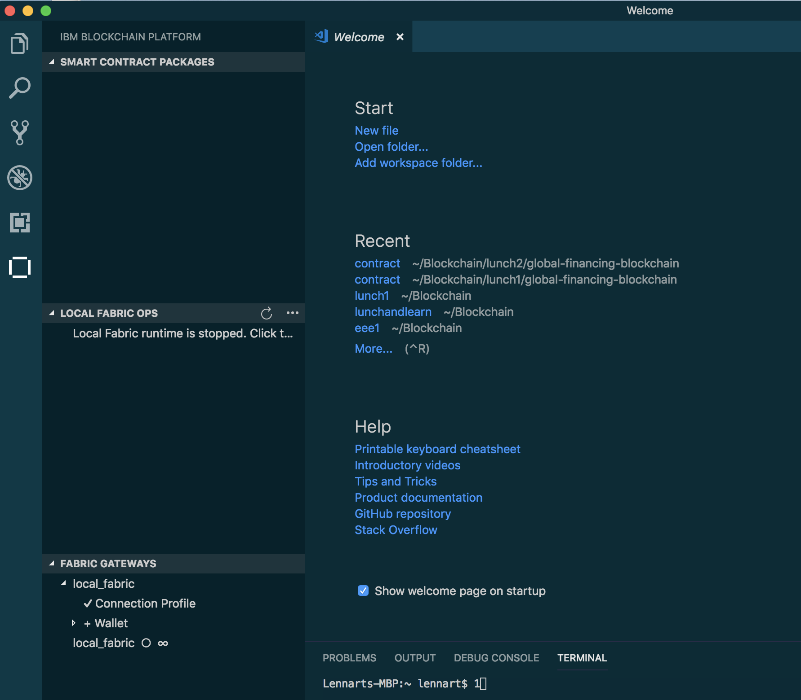
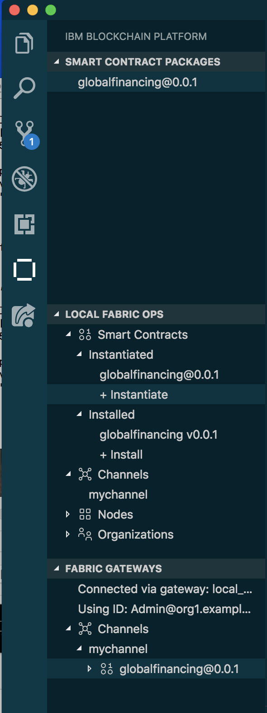
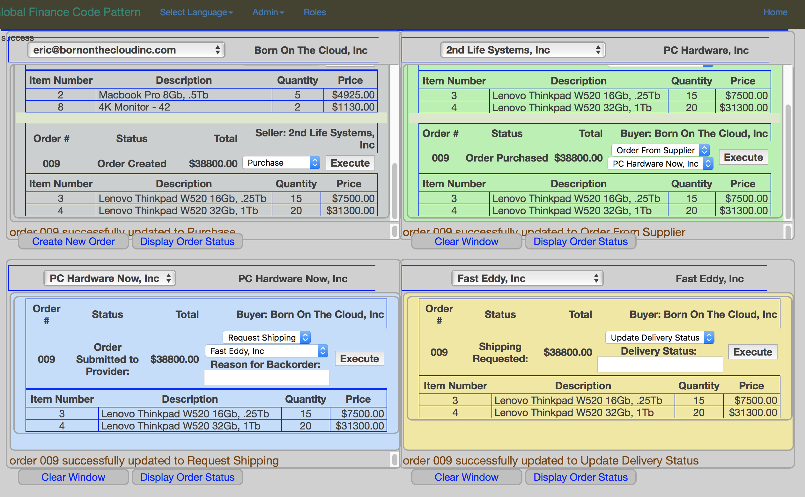

# Architecture

<p align="center">
  
</p>

The developer uses the IBM Blockchain Platform Extension for VS Code to:

1. Package a smart contract.
1. Launch a local Hyperledger Fabric Network.
1. Install chaincode on the peer node.
1. Instantiate the chaincode on the peer node.
1. Use a Global Finance application to interact with the Hyperledger Fabric network through API calls using the `fabric-network` npm library. Admins can also use the application to create new participants.

# Components

* [IBM Blockchain Platform Extension for VS Code](https://marketplace.visualstudio.com/items?itemName=IBMBlockchain.ibm-blockchain-platform) is designed to assist users in developing, testing, and deploying smart contracts -- including connecting to Hyperledger Fabric environments.
* [Hyperledger Fabric v1.4](https://hyperledger-fabric.readthedocs.io) is a platform for distributed ledger solutions, underpinned by a modular architecture that delivers high degrees of confidentiality, resiliency, flexibility, and scalability.
* [Visual Studio Code](https://code.visualstudio.com/download) is a code editor that's redefined and optimized for building and debugging modern web and cloud applications.

## Technologies used
+ [Nodejs](https://www.python.org/) is an open source, cross-platform JavaScript run-time environment that executes server-side JavaScript code.
+ [Bootstrap](https://getbootstrap.com/) is an open source toolkit for developing with HTML, CSS, and JavaScript.

### Prerequisites

You will need to follow the requirements for the [IBM Blockchain Platform Extension for VS Code](https://github.com/IBM-Blockchain/blockchain-vscode-extension/blob/master/README.md#requirements):

- [VSCode version 1.26 or greater](https://code.visualstudio.com)
- [Node v8.x or greater and npm v5.x or greater](https://nodejs.org/en/download/)
- [Yeoman (yo) v2.x](http://yeoman.io/)
- [Docker version v17.06.2-ce or greater](https://www.docker.com/get-docker)
- [Docker Compose v1.14.0 or greater](https://docs.docker.com/compose/install/)

# Run the application

Note: to re-run the application from scratch: click on the three dots to the right of
'Local Fabric Ops' in the left pane of the Visual Studio Code and select Teardown Fabric Runtime.

## 1. Clone the repo

Clone this repository in a folder of your choice:

```
git clone https://github.com/IBM/global-financing-blockchain.git
```

The github repository consists of the following items:

1. CONTRIBUTING.md	
1. MAINTAINERS.md	
1. contract directory. Contains the Smart Contract	
1. web-app directory. Contains the web-app code
1. LICENSE		
1. README.md	
1. docs directory. Contains the docs screen capture images 


## 2. Use the VS Code extension to install a smart contract on a basic Fabric network

Open Visual Studio code and open the `contract` folder by selecting File/Open from the VSCode action bar.

Normally we would start by doing selecting 'Create a new Smart Contract Project'. But this has already been done
for us in the GitHub repo, we can see the result in the Contract directory that we pulled down with the Git command.
So we can start directly with the second step, 'Package  smart contract project'.

<p align="center">
  
</p>


## 2.1 Package the smart contract

Press the `F1` key to see the different VS code options. Choose `IBM Blockchain Platform: Package a Smart Contract Project`.

<p align="center">
  
</p>

Click the `IBM Blockchain Platform` extension button on the left. This will show the packaged contracts on top and the blockchain connections on the bottom.

<p align="center">
  
</p>

## 2.2 Setup a local_fabric

Click on `local_fabric` to start a network. This will download the Docker images required for a local Fabric setup, and start the network. You should see the output window as the network sets up.

<p align="center">
  
</p>

Click on `local_fabric` again; it should have a full white circle next to it. This should bring up `mychannel`. You are now ready to install the smart contract.


## 2.3 Install the smart contract

Click on `mychannel`, then `Peers`. This will display `peer0.org1.example.com`. Right click on it and choose `Install Smart Contract`:

<p align="center">
  
</p>

Choose the `globalfinancing@0.0.1` contract:

<p align="center">
  
</p>

## 2.4 Instantiate the smart contract

You are now ready to instantiate the smart contract. Right click on `mychannel` and choose `Instantiate Smart Contract`:

<p align="center">
  
</p>

Choose the `globalfinancing@0.0.1` contract:

<p align="center">
  
</p>

Type in `instantiate` for the function:

<p align="center">
  
</p>

You can press **Enter** for optional arguments.  

Once this is successfully instantiated, you should see a successful notification in the output view.

## 3. Run the application

In a new terminal, navigate to the `web-app` directory:

  ```bash
  cd global-financing-blockchain/web-app/
  ```

  Build the node dependencies:
  ```bash
  npm install
  ```

  Run the application:
  ```bash
  npm start
  ```
  
  To use the user interface, begin by doing:
  
  ````
  admin preload network
  ````
  You can then create orders and execute orders, please note that you have to execute the order you created to see how it    
  is handled by the four actors in the supply chain. 
  The actions in the supply chain is driven by the smart contract globalFinance.js in the contract/lib directory.
   
<div style='border: 2px solid #f00;'>
  
</div>

Unified member's view:
<div style='border: 2px solid #f00;'>
  
</div>


# Extending the code pattern
This application can be expanded in a couple of ways:
* Create a wallet for every member and use the member's wallet to interact with the application.
* Update the application to interact through the IBM Blockchain Platform starter plan on IBM Cloud.


## Links
* [Hyperledger Fabric Docs](http://hyperledger-fabric.readthedocs.io/en/latest/)
* [Zero to Blockchain](https://www.redbooks.ibm.com/Redbooks.nsf/RedbookAbstracts/crse0401.html?Open)
* [IBM Code Patterns for Blockchain](https://developer.ibm.com/patterns/category/blockchain/)

## License
This code pattern is licensed under the Apache Software License, Version 2. Separate third-party code objects invoked within this code pattern are licensed by their respective providers pursuant to their own separate licenses. Contributions are subject to the [Developer Certificate of Origin, Version 1.1 (DCO)](https://developercertificate.org/) and the [Apache Software License, Version 2](https://www.apache.org/licenses/LICENSE-2.0.txt).

[Apache Software License (ASL) FAQ](https://www.apache.org/foundation/license-faq.html#WhatDoesItMEAN)

## Lennart notes: 

1. If npm install and start don't work, do 'nvm use 8.12.0' to get the correct version of npm
1. docker rmi $(docker images -q)
1. In VSCode do teardown to rebuild the Blockchain system
